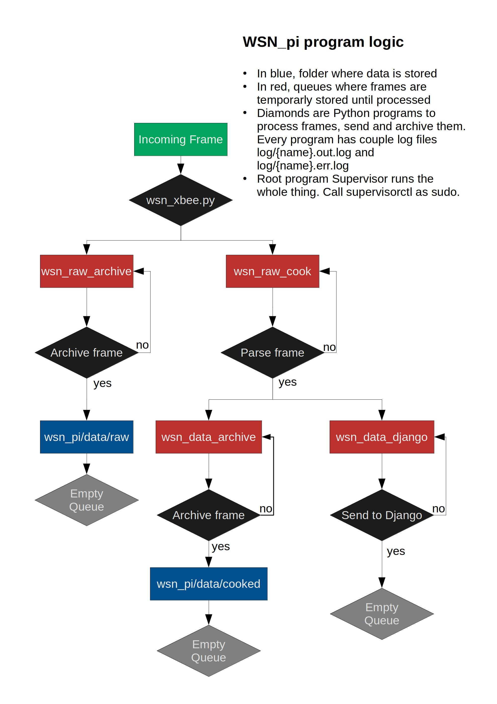

Install
=======

Python 3.7 or later is required.

Install system wide requirements::

  $ sudo apt install python3-venv rabbitmq-server supervisor

Clone the wsn_pi repository::

  $ git clone git@github.com:spectraphilic/wsn_pi.git
  $ cd wsn_pi
  $ nano config.ini
  set the config file following the config.ini.example template

Build::

  $ make install

Create a symbolic link, as root, to the supervisor configuration::

  $ sudo ln -s $PWD/supervisor.conf /etc/supervisor/conf.d/wsn.conf
  $ sudo supervisorctl reread
  $ sudo supervisorctl update

RabbitMQ: Plugins
=================

List plugins::

  # rabbitmq-plugins list

Example, the management plugin::

  # rabbitmq-plugins enable rabbitmq_management

With the management plugin enabled, you can:

- Go to http://localhost:15672/ and enter with username and password "guest".
- Use the command line rabbitmqadmin

XXX Do we need rabbitmq_management?

RabbitMQ (command line)
=======================

Informational::

  $ sudo rabbitmqctl list_exchanges
  $ sudo rabbitmqctl list_queues
  $ sudo rabbitmqctl list_bindings
  $ sudo rabbitmqctl list_connections

  $ sudo rabbitmqctl list_channels
  $ sudo rabbitmqctl list_consumers
  $ sudo rabbitmqctl status

Maintenance::

  $ sudo rabbitmqctl purge_queue <name>

RabbitMQ: Federated Exchange (TODO)
===================================

Everything below is done in the server:

Enable federation plugin::

  # rabbitmq-plugins enable rabbitmq_federation
  # rabbitmq-plugins enable rabbitmq_federation_management

Define the upstream::

  # rabbitmqctl set_parameter federation-upstream finse_pi '{"uri":"amqp://129.240.244.148"}'
  # rabbitmqctl set_parameter federation-upstream cs_pi '{"uri":"amqp://192.168.1.133"}'

Verify::

  # rabbitmqctl list_parameters

Define a policy, and verify::

  # rabbitmqctl set_policy --apply-to exchanges wsn "^wsn$" '{"federation-upstream-set":"all"}'
  # rabbitmqctl list_policies
  # rabbitmqctl eval 'rabbit_federation_status:status().'

Supervisor
===================================

The programs are managed by Supervisor, use ``supervisorctl`` to control them.
Supervisor runs as root, so you will need to run ``supervisorctl`` as root, or
use sudo.

The programs run in the foreground, Supervisor puts them in the background, and
restarts them if they exit.

Check that the programs are running::

  meshpiuio@raspberrypi:~/github/wsn_pi $ sudo supervisorctl status
  wsn_data_archive                 RUNNING   pid 1063, uptime 1:20:56
  wsn_data_django                  RUNNING   pid 1054, uptime 1:20:57
  wsn_raw_archive                  RUNNING   pid 1084, uptime 1:20:52
  wsn_raw_cook                     RUNNING   pid 1064, uptime 1:20:56
  wsn_xbee                         RUNNING   pid 1075, uptime 1:20:55

Restart programs when issues arise::

  meshpiuio@raspberrypi:~/github/wsn_pi $ sudo supervisorctl restart all

Enter the supervisorctl shell:

  meshpiuio@raspberrypi:~/github/wsn_pi $ sudo supervisorctl status

Algorithm structure
===================

